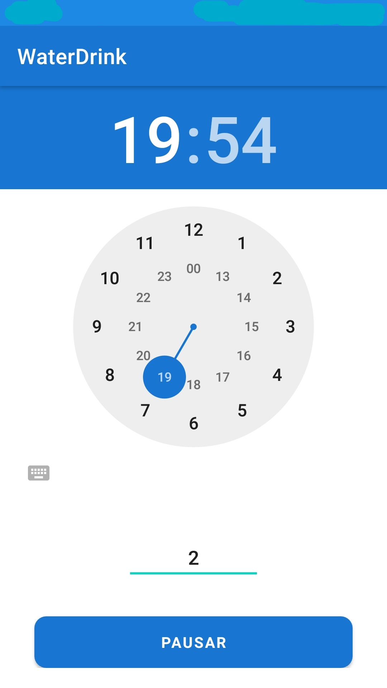
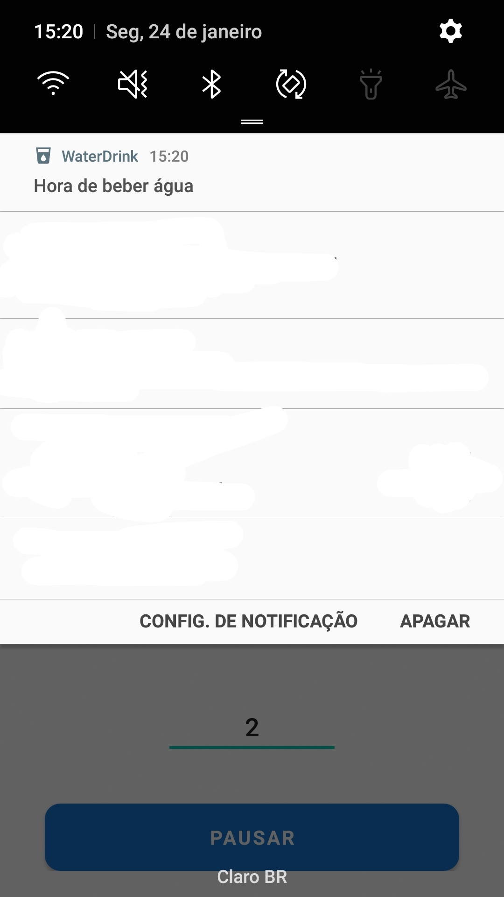
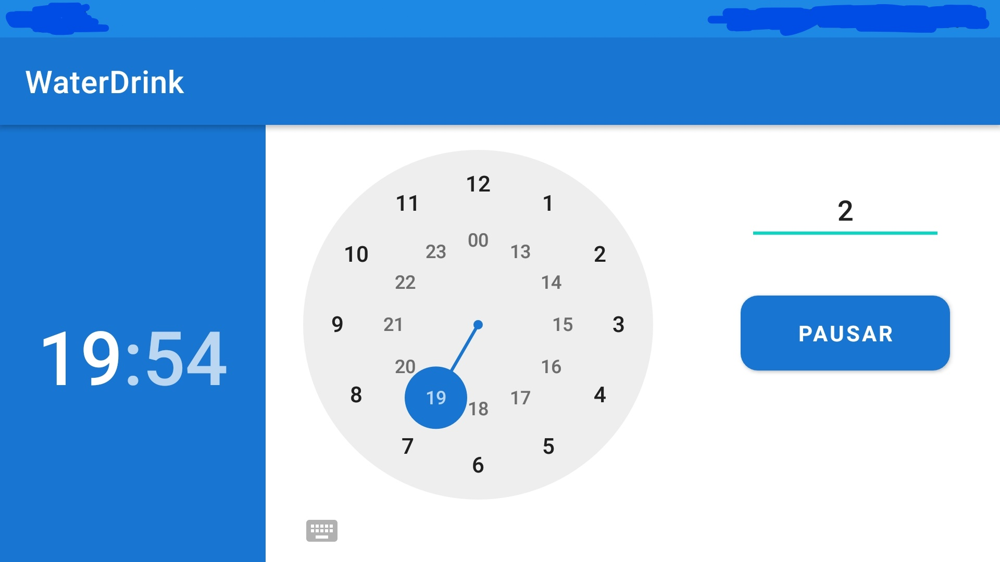

# Water Drink

:brazil:  

O aplicativo foi criado com o objetivo de ajudar o usuário a se manter saudável e beber bastante água. E foi feito durante o [Curso Android Express](https://androiddeveloper.com.br/android/iniciante-express).

:us: 

The app was created with the intention of assisting the user in staying healthy and drinking plenty of water.And it was done during the [Course Android Express](https://androiddeveloper.com.br/android/iniciante-express).

# Techs

- [Kotlin](https://kotlinlang.org)
- [BroadcastReceiver](https://developer.android.com/guide/components/broadcasts)
- [Notificações](https://developer.android.com/guide/topics/ui/notifiers/notifications)

# Project

